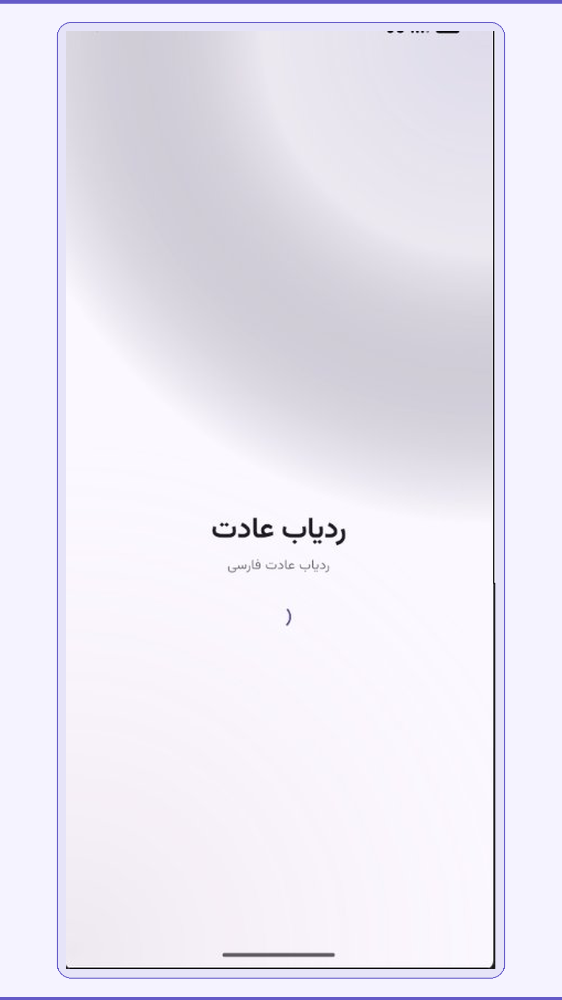
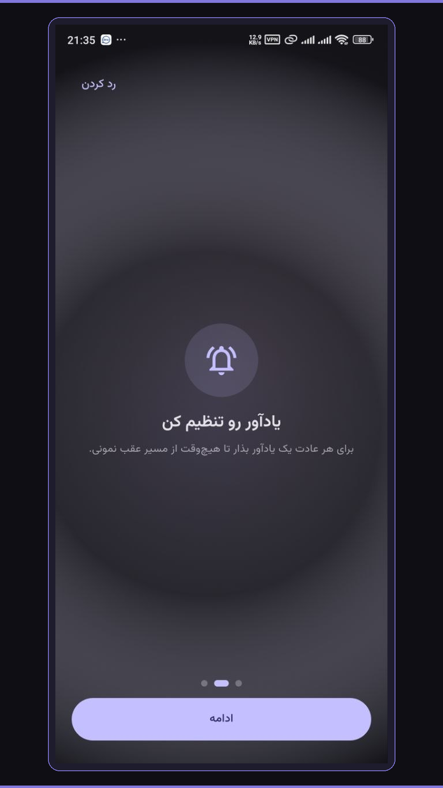
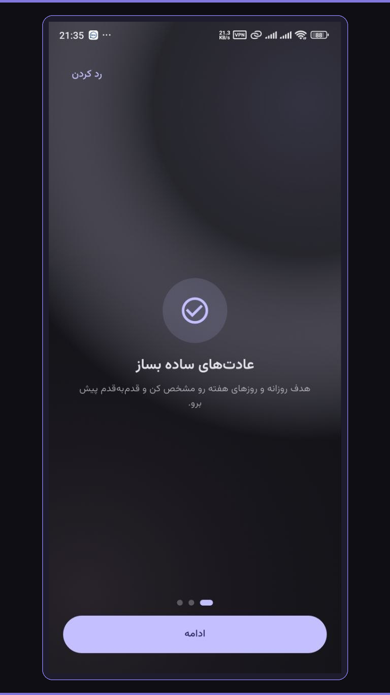
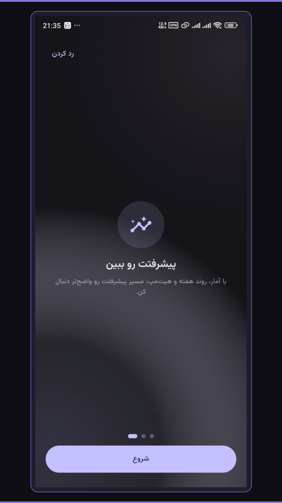
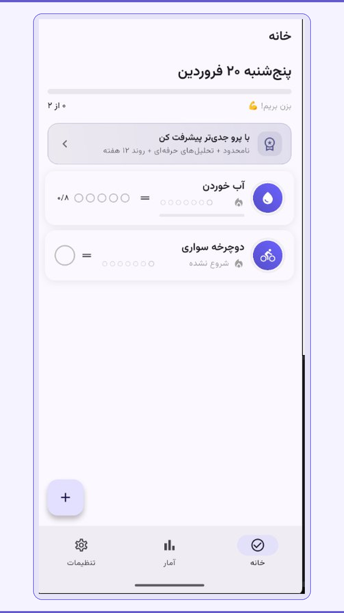
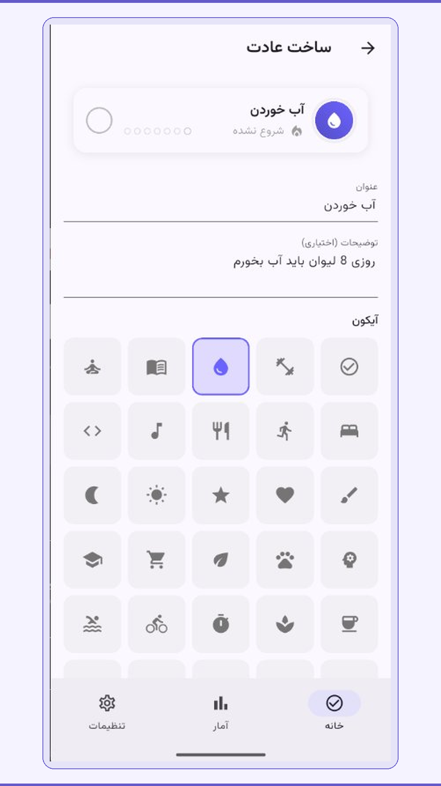
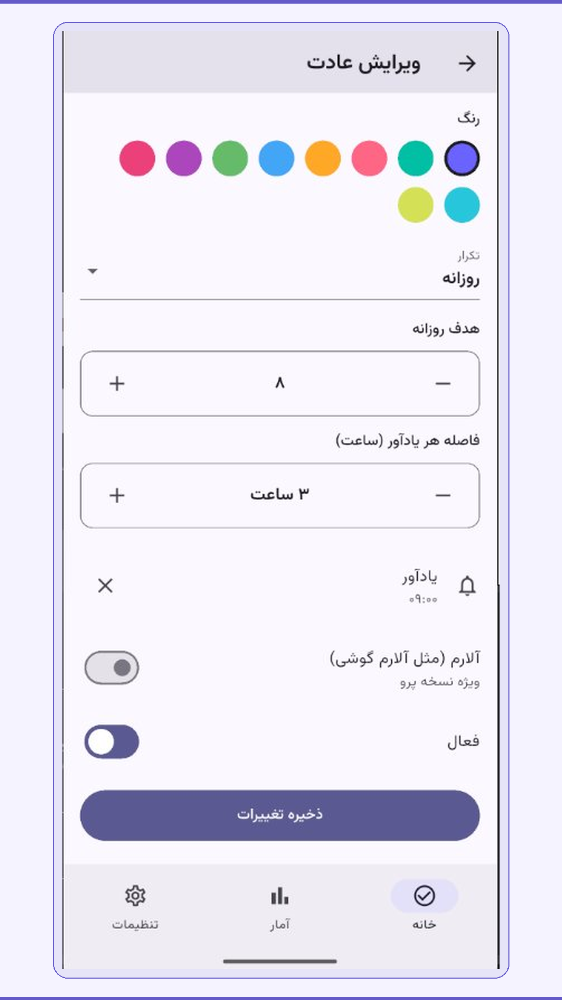
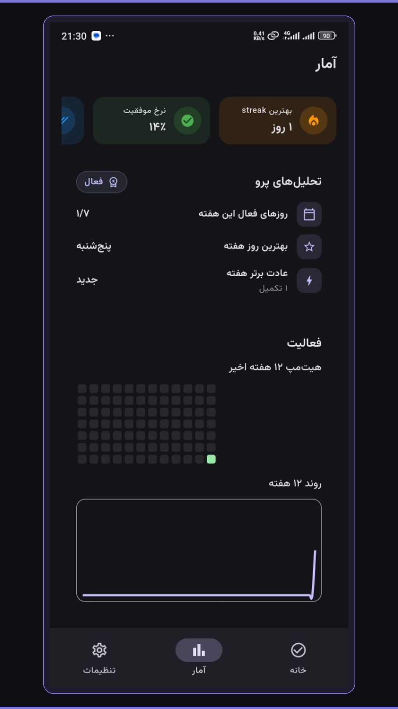
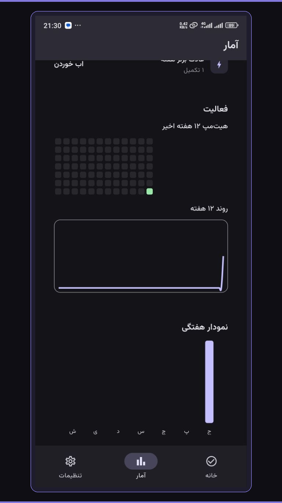

<div align="center">


</div>

<div align="center">

[](https://git.io/typing-svg)

</div>

---

<div align="center">


</div>

## 👨‍💻 About Me

```dart
class AchkanDev {
  final String name    = "Ashkan";
  final String role    = "Flutter Developer";
  final String focus   = "Mobile & Cross-Platform Apps";

  final List<String> expertise = [
    "Flutter / Dart",
    "Firebase (Auth, Firestore, Storage)",
    "Clean Architecture & BLoC",
    "REST APIs & Real-time Apps",
    "UI/UX Design Patterns",
  ];

  String get motto =>
    "Code is craft. Craft it beautifully. 🎨";
}
```

- 🔥 **826+ contributions** in the last year
- 📱 Passionate about building **pixel-perfect** Flutter apps
- ⚡ Expert in **Firebase** ecosystem integration
- 🏗️ Advocate for **Clean Architecture** & **BLoC pattern**
- 🌍 Always learning, always building

---

## 🛠️ Tech Stack

<div align="center">

### Mobile & Core


### Firebase


### State Management & Architecture


### Tools & Platforms


### Platforms I Target


</div>

---

## 📊 GitHub Stats

<div align="center">


</div>

<div align="center">

[](https://git.io/streak-stats)

</div>

<div align="center">

[](https://github.com/ashutosh00710/github-readme-activity-graph)

</div>

---

## 🚀 Featured Projects

---

### 🎮 فریم سنج (FrameSanj) — PC Game Compatibility & Performance Analyzer

<div align="center"> 


> Offline PC game compatibility & FPS estimator — search games, compare your CPU/GPU/RAM with minimum & recommended requirements, and get suggested quality + FPS.

| | | |
|:--:|:--:|:--:|
|  |  |  |
|  |  |  |
|  |  |  |

🔗 [**View Showcase →**](https://github.com/AchkanDev/gamegauge-showcase) &nbsp; | &nbsp; 📲 CafeBazaar: — &nbsp; | &nbsp; 📲 Myket: —

</div>

---

### 🔤 واژه جو (VazheJoo) — Persian Offline Word Finder

<div align="center">


> Persian offline word finder to discover hidden words using Persian letters.

| | | |
|:--:|:--:|:--:|
|  |  |  |
|  |  |  |

🔗 [**View Showcase →**](https://github.com/AchkanDev/vazhejoo-showcase) &nbsp; | &nbsp; 📲 [CafeBazaar](https://cafebazaar.ir/app/com.achkandev.vazhejoo) &nbsp; | &nbsp; 📲 [Myket](https://myket.ir/app/com.achkandev.vazhejoo)

</div>

---

### ✅ ردیاب عادت (Habit Tracker) — Persian Habit Tracking App

<div align="center">


> Persian habit tracker with onboarding, daily workflow, smart reminders, edit/create flows, and advanced weekly + 12-week analytics.

| | | |
|:--:|:--:|:--:|
|  |  |  |
|  |  |  |
|  |  |  |

🔗 [**View Showcase (Private for now) →**](https://github.com/AchkanDev/habit-tracker-showcase)

</div>

---

### ⚖️ ویکیلا (WeekiLaw) — AI-Powered Legal Services Platform

<div align="center">


> Connects citizens with verified lawyers + AI legal assistant + lawyer smart office — cross-platform.

| | | | | |
|:--:|:--:|:--:|:--:|:--:|
|  |  |  |  |  |

🔗 [**View Showcase →**](https://github.com/AchkanDev/weekilaw-showcase) &nbsp; | &nbsp; 📲 [CafeBazaar](https://cafebazaar.ir/app/com.pqlian.weekilaw) &nbsp; | &nbsp; 📲 [Myket](https://myket.ir/app/com.pqlian.weekilaw)

</div>

---

### 🕌 مبین (Mobin) — Spiritual Companion App

<div align="center">


> Daily prayers, Qibla direction, prayer times, Dhikr counter & more. Published with 1,500+ installs.

| | | | |
|:--:|:--:|:--:|:--:|
|  |  |  |  |
|  |  |  |  |

🔗 [**View Showcase →**](https://github.com/AchkanDev/mobin-app-showcase) &nbsp; | &nbsp; 📲 [CafeBazaar](https://cafebazaar.ir/app/?id=ir.mobinapp.mainapp)

</div>

---

### 💡 Yariex — Modern Flutter App · Clean Architecture

<div align="center">


> Feature-rich Flutter application with modern UI, real-time Firebase backend & Clean Architecture.

| | | | | |
|:--:|:--:|:--:|:--:|:--:|
|  |  |  |  |  |

🔗 [**View Showcase →**](https://github.com/AchkanDev/yariex-showcase)

</div>

---

### 📸 Instagram Clone — Full-Stack Flutter + Firebase

<div align="center">


> Full clone with real-time feed, likes, comments, DMs, user profiles & Firebase Auth.

| Feed | Profile | Post | Stories |
|:----:|:-------:|:----:|:-------:|
|  |  |  |  |

🔗 [**View on GitHub →**](https://github.com/AchkanDev/Instagram_with_fireBase)

</div>

---

### 👟 Nike Store — Premium E-Commerce Flutter App

<div align="center">


> Beautifully crafted Nike-inspired shoe store with smooth animations & complete shopping flow.

| Home | Listing | Detail | Cart |
|:----:|:-------:|:------:|:----:|
|  |  |  |  |

🔗 [**View on GitHub →**](https://github.com/AchkanDev/Nike_store)

</div>

---

### 🗂️ More Repositories

<div align="center">

| Project | Description | Tech |
|---------|-------------|------|
| [👤 Profile Application](https://github.com/AchkanDev/ProfileApplication) | Interactive profile & portfolio app | Flutter · Dart |
| [✅ To-Do List](https://github.com/AchkanDev/To_Do_List) | Clean task management with local persistence | Flutter · Dart |
| [🖥️ Work with Server](https://github.com/AchkanDev/work_with_server) | REST API integration patterns | Flutter · HTTP |
| [⛏️ Mining Data](https://github.com/AchkanDev/MiningData) | Data mining & analysis project | Python |

</div>

---

## 🏆 GitHub Trophies

<div align="center">

[](https://github.com/ryo-ma/github-profile-trophy)

</div>

---

## 🌊 Flutter Expertise

<div align="center">

```
Flutter Development    ████████████████████  Expert
Dart Language          ████████████████████  Expert
Firebase Integration   ███████████████████░  Advanced
BLoC / State Mgmt      ██████████████████░░  Advanced
Clean Architecture     █████████████████░░░  Advanced
REST API Integration   ██████████████████░░  Advanced
UI/UX Implementation   ████████████████████  Expert
Animation & Effects    ████████████████░░░░  Proficient
```

</div>

---

## 📫 Connect with Me

<div align="center">

[](https://github.com/AchkanDev)
[](https://linkedin.com/in/AchkanDev)
[](mailto:ashkan.abavi1@gmail.com)

</div>

---

<div align="center">

### 👁️ Profile Views


### 💬 Dev Quote of the Day
[](https://github.com/piyushsuthar/github-readme-quotes)

<br/>

> *"First, solve the problem. Then, write the code."* — John Johnson

<br/>


</div>
